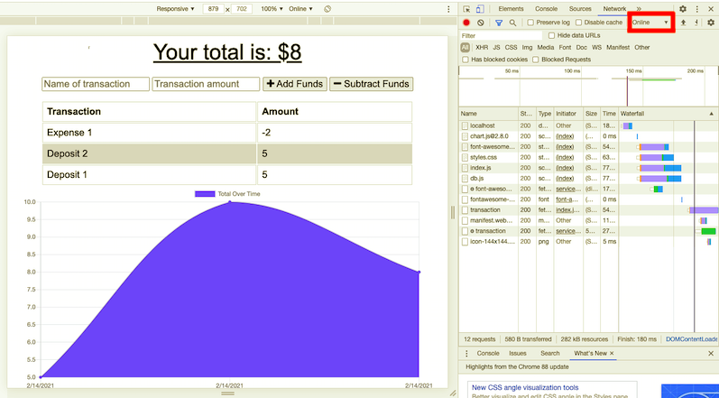
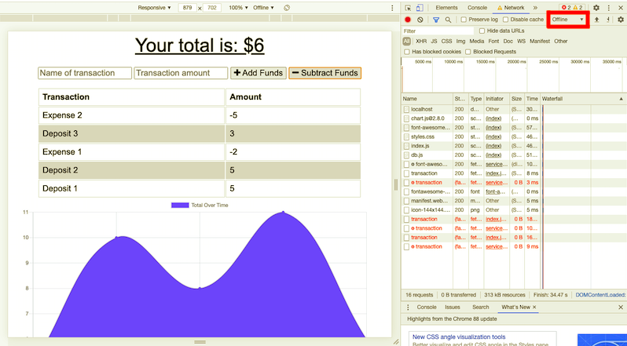
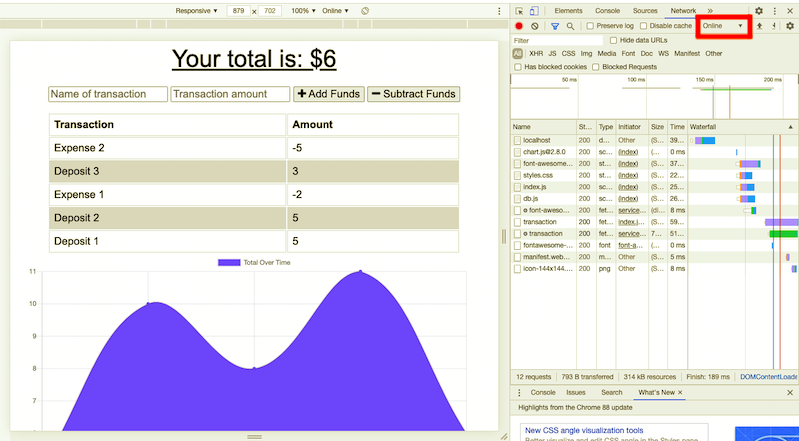

# Unit 19 PWA Homework: Online/Offline Budget Trackers

## Description

Check out the deployed link hosted on Heroku [here](https://budget-tracker-pwa-by-uyen.herokuapp.com/).

This budget tracker is a progressive web application (PWA), which allows offline access and functionality.

The user will be able to add expenses and deposits to their budget with or without a connection. When entering transactions offline, they should populate the total when brought back online.

Offline Functionality:

  * Enter deposits offline

  * Enter expenses offline

When brought back online:

  * Offline entries should be added to tracker.

### User Story

```
AS AN avid traveller
I WANT to be able to track my withdrawals and deposits with or without a data/internet connection
SO THAT my account balance is accurate when I am traveling
```

### Screenshots

* Online


* Offline


* Back to online


## Credits

This application is created by me with the initial materials by Trilogy.
